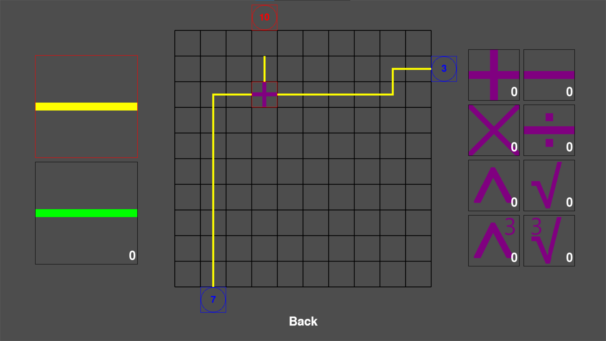
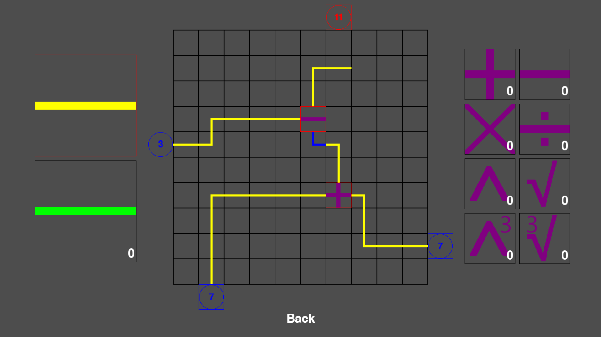
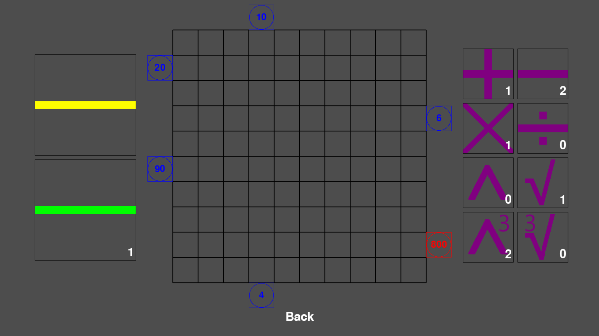
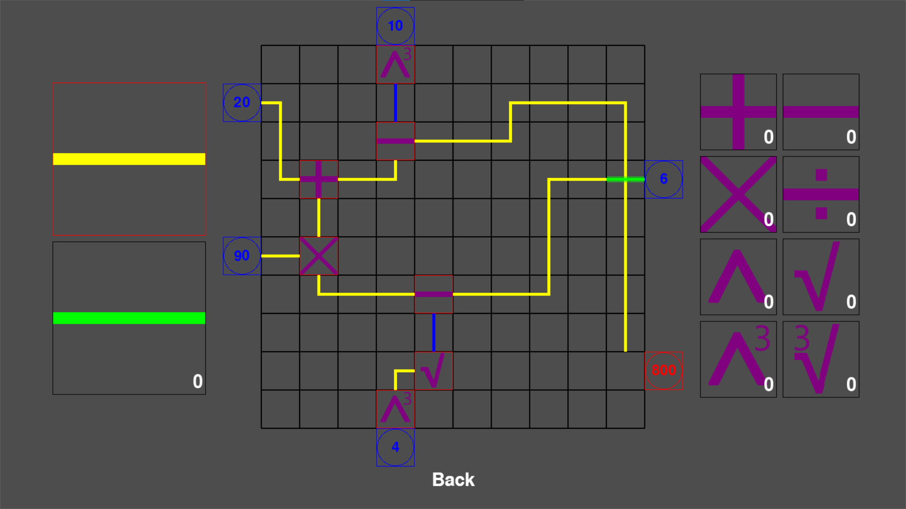

# Mathematical Puzzle Game

A mathematical puzzle game developed in **Python** using **PyGame**.

The project was created as a college diploma project for the topic **"Mathematical Puzzles in Games"**. The gameplay is based on building mathematical expressions by connecting numbered nodes with wires and mathematical operators.

Levels are described using JSON files, allowing new puzzles to be added without modifying the game logic.

---

## Gameplay

Each level contains several numbered input nodes and one target output node.

The objective is to obtain the required output value by connecting inputs with wires and mathematical operators.

Available operators:

- Addition
- Subtraction
- Multiplication
- Division
- Square
- Square Root
- Cube
- Cube Root

For subtraction and division, the order of operands matters. A priority connection allows the player to select which input is processed first.

---

## Implementation

The project includes:

- Object-oriented project structure
- JSON-based level configuration
- Recursive graph traversal used to validate completed puzzles
- Progress saving system
- Level selection menu

---

## Technologies

- Python
- PyGame
- JSON

---

## Screenshots

### Level 1
Introduction to the core gameplay mechanics.



### Level 2
Demonstrates subtraction and the priority connection mechanic.



### Level 4 (Empty)
Initial state of one of the larger puzzles.



### Level 4 (Solved)
Completed solution demonstrating mathematical operators and wire routing.



---

## Running the Project

```bash
pip install -r requirements.txt
python main.py
```
